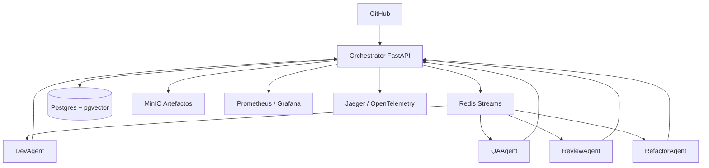
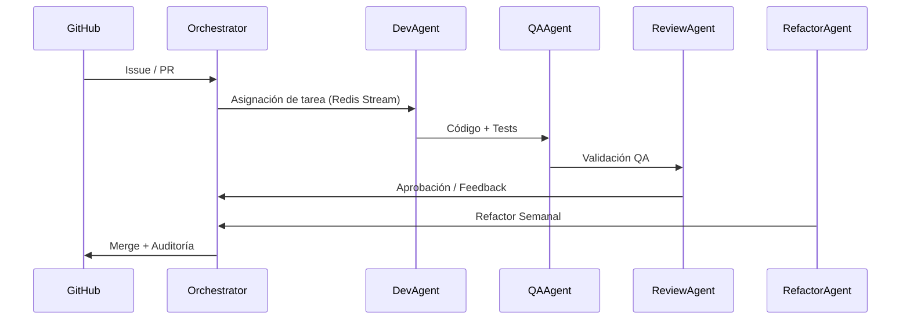

# 🤖 Agentes AI – Equipo de Desarrollo

> **Versión:** v2.0 — Octubre 2025  
> **Auditoría completada:** ✔️ Arquitectura, Seguridad, Escalabilidad y XP  
> **Documentación completa:** [/docs](docs/INDEX_v2.md)

---

---

## 🧭 Visión General

**Agentes AI – Equipo de Desarrollo** es un ecosistema de agentes inteligentes que trabajan colaborativamente para **escribir, probar y revisar software** bajo los principios de **Extreme Programming (XP)** y **Scrum**.  
El sistema actúa como una **fábrica de software autónoma**, donde cada agente cumple un rol especializado dentro de un flujo trazable y seguro.

- 🧠 **DevAgent:** genera código y tests (TDD).  
- 🧪 **QAAgent:** ejecuta validaciones y métricas de calidad.  
- 👁️ **ReviewAgent:** revisa PRs y aprueba merges.  
- 🛠️ **RefactorAgent:** corrige deuda técnica y mantiene el sistema.  
- 🤝 **PairCoordinator:** coordina sesiones de pair programming.  
- ⚙️ **Orchestrator:** cerebro central que coordina todo el flujo.

> “El objetivo no es solo generar código, sino construir **software que se mejora a sí mismo**.”

---

## 🏗️ Arquitectura General

**Stack principal:**  
FastAPI • Redis Streams • Postgres • MinIO • Prometheus • Grafana • Docker Swarm • Traefik

---

## 📚 Documentación Técnica

| Sección | Descripción |
|----------|--------------|
| [01 - Resumen y Objetivos](docs/01_resumen_y_objetivos.md) | Propósito y visión general del sistema |
| [02 - Arquitectura General](docs/02_arquitectura_general.md) | Diseño estructural y flujos de datos |
| [03 - Componentes Técnicos](docs/03_componentes_tecnicos.md) | Detalle de cada módulo y su relación |
| [04 - Infraestructura y Despliegue](docs/04_infraestructura_y_despliegue.md) | Entorno, redes, HA, Swarm |
| [05 - Prácticas XP y Ciclo de Desarrollo](docs/05_practicas_xp_y_ciclo_desarrollo.md) | Implementación XP completa |
| [06 - Seguridad y Aislamiento](docs/06_seguridad_y_aislamiento.md) | Sandboxing, secretos, auditoría |
| [07 - Escalabilidad y Optimización](docs/07_escalabilidad_y_optimizacion.md) | Caching, routing, auto‑scaling |
| [08 - Métricas y Monitoreo](docs/08_metricas_y_monitoreo.md) | KPIs, dashboards, alertas |
| [09 - Roadmap y Plan de Implementación](docs/09_roadmap_y_plan_implementacion.md) | Sprints 0–3 y roadmap extendido |
| [10 - Anexos Operativos](docs/10_anexos_operativos.md) | Runbooks, incidentes y mantenimiento |

📘 **Índice completo:** [INDEX_v2.md](docs/INDEX_v2.md)

---

## 🧱 Ciclo XP Automatizado

**Prácticas XP activas:**  
TDD ✅ • Pair Programming ✅ • Refactorización Continua ✅ • DoD Automático ✅ • Propiedad Colectiva 🔄

---

## 🔐 Seguridad y Trazabilidad

- Código generado ejecutado solo en sandboxes aislados.  
- Ningún agente accede a secretos de producción.  
- Auditoría inmutable en Postgres (particionada por mes).  
- Traefik gestiona TLS y exposición segura.  
- Límite de presupuesto de tokens por sprint (TokenBudgetManager).

> “Nada se ejecuta sin control, nada se pierde sin registro.”

---

## 📈 Estado Actual

| Área | Estado | Observaciones |
|------|---------|----------------|
| Infraestructura base | ✅ Operativa | Orchestrator HA + Redis Streams |
| XP completo | ✅ Activo | TDD, Refactor, Pair, QA |
| Observabilidad | ✅ Integrada | Prometheus + Grafana + Jaeger |
| Seguridad | ✅ Validada | Sandbox + secretos + DoD |
| Escalabilidad | 🔄 En curso | Cache + routing + autoscaling |
| Documentación | ✅ Completa | v2 finalizada tras auditoría |

---

## 🗺️ Roadmap 2025

| Sprint | Enfoque | Objetivo |
|---------|----------|-----------|
| **S0** | Core & Resiliencia | Infraestructura base + HA |
| **S1** | XP Compliance | XP completo + observabilidad |
| **S2** | Optimización | Pair programming + caching |
| **S3** | Madurez | Escalado y eficiencia de costos |

---

## 💡 Por qué este proyecto importa

Este sistema representa un nuevo paradigma: **equipos de IA colaborando bajo reglas humanas**, no reemplazando humanos.  
Es una arquitectura viva, capaz de aprender, auditarse y mejorar con cada iteración.

> “No es IA generando código; es una metodología entera automatizada.”

---

## 👥 Equipo y Roles

| Rol | Responsable |
|------|-------------|
| Product Owner | **Max** |
| Arquitectura XP | **GPT‑5 (Asistente IA)** |
| DevOps & Infraestructura | **DevAgent** |
| QA / Refactor | **QAAgent / RefactorAgent** |
| Revisión | **ReviewAgent** |

---

## 🧾 Licencia

Este proyecto se distribuye bajo la licencia **MIT**.  
Puedes usarlo, modificarlo y adaptarlo libremente, manteniendo la atribución.

---

**© 2025 – Proyecto Agentes AI – Equipo de Desarrollo**  
> “El código se escribe en Python, pero la arquitectura se escribe en disciplina.”
